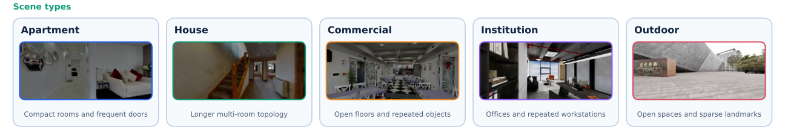
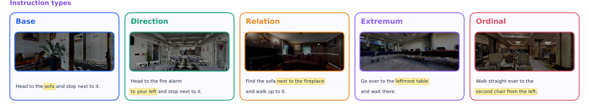
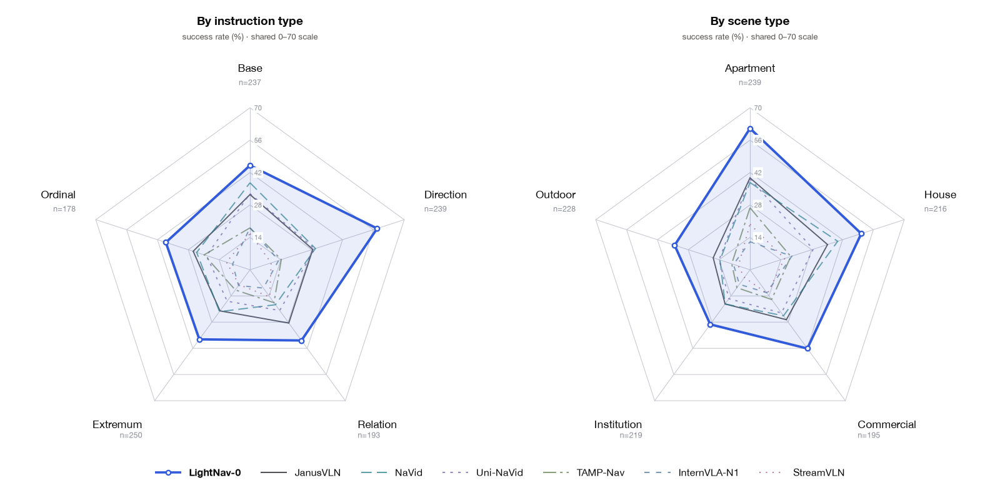
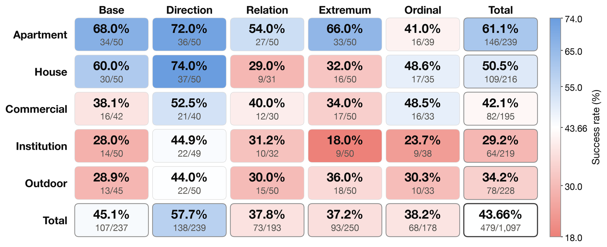
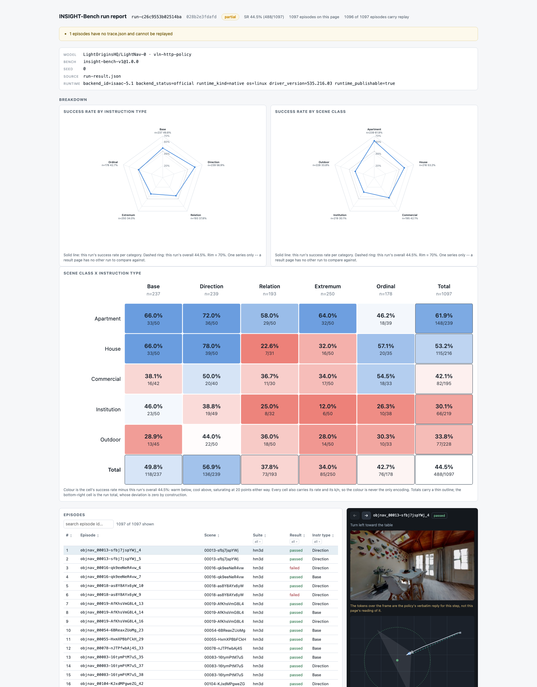

<h1 align="center">INSIGHT-Bench</h1>

<div align="center">


[](https://huggingface.co/datasets/LightOriginsHQ/light-insight-bench)
[](https://arxiv.org/abs/2608.30935)
[](LICENSE)
[](pyproject.toml)

</div>

This repository is the evaluation release for [LightNav-0](https://github.com/lightorigins/LightNav-0): the 1,097-episode
split, the Isaac Lab runner that drives it, adapters that put seven policies behind one interface, and the evidence packer
that turns a run into a submission.

## 🏡 About

1,097 episodes in 210 held-out scenes. Every episode carries two labels, fixed when it is built, and together they turn
one success rate into a diagnosis.

<div align="center">

<br><br>

</div>

**Scene class** is functional layout, independent of the source dataset: compact rooms with frequent doors (Apartment),
longer multi-room topologies (House), open floor plans with repeated instances (Commercial), corridors and repeated
workspaces (Institution), open traversable regions with sparse landmarks (Outdoor). **Instruction type** is the mechanism
that resolves the goal: a uniquely nameable target (`Base`), an egocentric bearing (`Direction`), a unique anchor object
(`Relation`), an argmin or argmax such as the nearest or leftmost (`Extremum`), a ranked instance of an ordered set
(`Ordinal`). Rows of the 5x5 breakdown expose sensitivity to layout, columns isolate the language mechanism, and single
cells expose the interaction the aggregate hides.

| Scene type | Scenes | Episodes | Base | Direction | Relation | Extremum | Ordinal |
| :--- | ---: | ---: | ---: | ---: | ---: | ---: | ---: |
| Apartment | 120 | 239 | 50 | 50 | 50 | 50 | 39 |
| House | 61 | 216 | 50 | 50 | 31 | 50 | 35 |
| Commercial | 10 | 195 | 42 | 40 | 30 | 50 | 33 |
| Institution | 11 | 219 | 50 | 49 | 32 | 50 | 38 |
| Outdoor | 8 | 228 | 45 | 50 | 50 | 50 | 33 |
| **Total** | **210** | **1,097** | **237** | **239** | **193** | **250** | **178** |

Every policy is driven through one shared deployment protocol. Nothing here is per-model.

| | |
| :--- | :--- |
| Observation | forward-facing monocular RGB, 480x270 — no depth, no odometry, no panorama |
| Field of view | 120° horizontal |
| Camera height | 1.0 m |
| Action budget | 300 actions per episode |
| Success radius | 2.0 m indoor, 3.0 m outdoor |
| Success condition | stop inside the radius **and** the target lies inside the 120° field of view of the final frame |
| Metrics | SR, SPL, terminal NE — printed as `success-rate`, `spl` and `distance_to_goal` |

**NE is `metrics.distance_to_goal` in the run result** — the straight line from where the agent stopped to the target.
A trace carries a different, route-following distance under `route_distance_remaining_m`; do not read that one as NE.

## 💡 Installation

A run needs Linux and an NVIDIA RTX GPU: rendering requires RT cores, so the A100 / A800 / A30 / H100 / H800 / H20 / V100
class cannot be used. Budget about **13 GB of VRAM for the simulator** and whatever your model needs beside it — LightNav-0
takes roughly 11 GB, so a 24 GB card is comfortable. You also need a writable cache: Isaac, Hugging Face and vLLM all write
one, and if your root filesystem is small, point `TMPDIR`, `HF_HOME`, `XDG_CACHE_HOME` and `VLLM_CACHE_ROOT` somewhere with
room before you start.

Anything in `<angle brackets>` from here on is a path only you know: replace it, brackets and all.

### 1. Isaac Sim 5.1.0 + Isaac Lab 2.3.2

```bash
python3.11 -m venv $HOME/isaac-venv && source $HOME/isaac-venv/bin/activate
pip install -U torch==2.7.0 torchvision==0.22.0 --index-url https://download.pytorch.org/whl/cu128
pip install "isaacsim[all,extscache]==5.1.0" --extra-index-url https://pypi.nvidia.com
git clone https://github.com/isaac-sim/IsaacLab.git --branch v2.3.2
(cd IsaacLab && ./isaaclab.sh --install none)
export ISAACLAB_DIR=$PWD/IsaacLab
export OMNI_KIT_ACCEPT_EULA=YES     # you are accepting NVIDIA's Omniverse licence
```

`OMNI_KIT_ACCEPT_EULA` is not optional, and it is not only an install-time setting: **every run needs it in the
environment**, including runs by someone who already had Isaac Lab and skipped this step. Without it the first
`import isaacsim` stops at an interactive licence prompt and waits forever, with nothing in any log to say why. Add
`export OMNI_KIT_ALLOW_ROOT=1` as well if you run as root, and keep both in your shell profile.

About 110 GB once the extension cache is populated, and an NVIDIA GPU must be present while it runs.
`ISAAC_DIR=/where/there/is/room bash scripts/setup_isaac_env.sh` does all of this into one directory instead, and prints
the `ISAACLAB_DIR` to export.

Any Isaac Lab 2.2 or newer on Isaac Sim 5.1.0 works; 2.3.2 is the current patch of the line Isaac Sim 5.1 shipped with,
and is what the reference runs behind this repository were produced on, with driver 535.216.03. The runtime you actually
used is recorded in every run result, so a leaderboard row always says which one produced it — as the `isaaclab`
package version rather than the release name, because the package is what a running process can ask: 2.3.2 reports
`0.54.2`, 2.2.1 reports `0.46.3`.

### 2. This repository

```bash
git clone https://github.com/lightorigins/light-insight-bench.git && cd light-insight-bench
export EVAL_DIR=$PWD
# From step 1. If you already had Isaac Lab, export these three yourself:
#   export ISAACLAB_DIR=<path/to/IsaacLab>
#   export OMNI_KIT_ACCEPT_EULA=YES     # every run needs it, not just the install
#   export OMNI_KIT_ALLOW_ROOT=1        # only if you run as root
$ISAACLAB_DIR/isaaclab.sh -p -m pip install -e .
$ISAACLAB_DIR/isaaclab.sh -p -m insight_bench --version
```

That prints `insight-bench 0.2.0`. Both spellings are deliberate and neither is interchangeable:
`insight_bench` with an underscore is the Python package, so it is what `import` and `python -m` take;
`insight-bench` with a hyphen is the command and the distribution, and `insight-bench-v1` is the
benchmark's published coordinate, where a hyphen is the only legal separator. One Isaac Lab serves one checkout: the editable install replaces any previous one, so
two clones sharing an `ISAACLAB_DIR` take turns rather than coexist. Every command below uses the `isaaclab.sh -p -m` form, because the console script the
install creates lives in Isaac Lab's own `bin`, not on your `PATH`.

### 3. Data

The episode file is a Hugging Face dataset:

```bash
export DATA_DIR=$EVAL_DIR/data
hf download LightOriginsHQ/light-insight-bench --repo-type dataset --local-dir $DATA_DIR
```

`hf` is the Hugging Face Hub CLI — `pip install -U huggingface_hub` provides it, and `hf download` needs a
reasonably recent one. Nothing here is gated, so no token is required.

That package carries the episode file and 10 converted Habitat-GS scenes — the only ones whose licence permits
redistribution. **The other 200 scenes you obtain and convert yourself**, under their own licences:

| Source | Scenes | Where to get them | Licence |
| :--- | ---: | :--- | :--- |
| `habitat_gs` | 10 | already converted, in the episode package. Upstream: <https://huggingface.co/datasets/RukawaY/gs_scenes> | Apache-2.0; attribution required |
| `interiorgs` | 75 | <https://huggingface.co/datasets/spatialverse/SAGE-3D_InteriorGS_usdz> | CC BY-NC 4.0, non-commercial |
| `hm3d` | 73 | <https://matterport.com/habitat-matterport-3d-research-dataset> | academic EULA, access request required |
| `mp3d` | 52 | <https://niessner.github.io/Matterport/> | Matterport3D Terms of Use, signed |
| **Total** | **210** | | |

[SCENES.md](SCENES.md) lists every scene by id, under the scene class it is labelled with and the source it comes from.

**HM3D and MP3D ship a mesh, not a USD stage, so you convert them.** That part is an ordinary, well-solved job and we
do not have a recipe to add to it: Omniverse's asset converter reads both formats, and so do Blender and the usual
glTF↔USD tools.

A stage is right for this benchmark when it is Z-up, `metersPerUnit` 1.0, has a `defaultPrim`, keeps its textures beside
it, and carries polygons for the floor and wall queries. **Check it rather than assume it** — the episode package ships
[`scripts/verify_scene.py`](https://huggingface.co/datasets/LightOriginsHQ/light-insight-bench/blob/main/scripts/verify_scene.py) for exactly this:

```bash
pip install usd-core      # a few seconds; Isaac Lab's own interpreter cannot import USD without booting Kit
python3 scripts/verify_scene.py scenes/mp3d/<scan>/<scan>.usd --episodes insight_bench/v1/episodes.jsonl
```

It checks each of those properties and then the one they cannot stand in for: **that this scene's own episode start
poses land inside its geometry**. A stage can satisfy every property and still sit in the wrong place, and that is the
failure that quietly costs you a score rather than a crash. Run it on one scene before converting two hundred. If it
fails and you want something to compare against, ours came from HM3D's `.glb` and from the `.obj` inside MP3D's
`matterport_mesh/` — not Habitat's MP3D `.glb`.


`interiorgs` has two published forms and only the
[SAGE-3D USDZ conversion](https://huggingface.co/datasets/spatialverse/SAGE-3D_InteriorGS_usdz) is usable here — the
other is gated and forbids redistribution. It is 110 GB for 1,000 scenes; the 75 this suite needs are 7.47 GB, a partial
download is enough, and no token is needed.

The 75 you need are whichever ones the episode file names, so read them out of it rather than
guessing. **A scene id is not its filename**: upstream the file is the id's second numeric field,
so `interior_0270_840784` lives at `InteriorGS_usdz/840784.usdz`.

```bash
python3 - "$DATA_DIR/insight_bench/v1/episodes.jsonl" > /tmp/interiorgs.txt <<'IDS'
import json, sys
seen = {}
for line in open(sys.argv[1], encoding="utf-8"):
    scene = json.loads(line)["scene"]
    if scene["dataset"] == "interiorgs":
        seen[scene["asset"].split("/")[1]] = None
for scene_id in seen:
    print(scene_id)
IDS
# One --include, every pattern after it. Repeating the flag keeps only the last
# pattern and quietly downloads a single scene.
hf download spatialverse/SAGE-3D_InteriorGS_usdz --repo-type dataset \
  --local-dir <where/there/is/room> \
  --include $(while read -r id; do printf 'InteriorGS_usdz/%s.usdz ' "${id##*_}"; done < /tmp/interiorgs.txt)
```

Give each scene its own directory named by the scene id, and put the downloaded file in it under
that same name, so `840784.usdz` becomes `interiorgs/interior_0270_840784/interior_0270_840784.usdz`.
The numeric field is then only ever a download detail.

**Those USDZ files need a different wrapper from ours.** Each one carries
`((-1,0,0,0),(0,0,-1,0),(0,-1,0,0),(0,0,0,1))` on its own `Volume` prim, and that matrix is its own
inverse, so a wrapper repeating it cancels it and the payload lands in the frame the episodes were
authored in. Write one wrapper per scene beside the payload, as `<scene_id>_zup.usda`, complete with
the header — without it the stage fails to open at all:

```
#usda 1.0
(
    defaultPrim = "World"
    metersPerUnit = 1
    upAxis = "Z"
)
def Xform "World"
{
    def "scene" (
        prepend references = @./<scene_id>.usdz@
    )
    {
        matrix4d xformOp:transform = ( (-1,0,0,0), (0,0,-1,0), (0,-1,0,0), (0,0,0,1) )
        uniform token[] xformOpOrder = ["xformOp:transform"]
    }
}
```

**Check a frame against a known-good one before you trust a run.** Get the wrapper wrong and the
scene loads, renders, scores, packs and **verifies** without a single warning while showing the
model bright fog. A run's poses come from the episode file, so a wrong transform moves the scene
rather than the agent, and every pose-based check still passes.

There are two first-frame checks and they do not behave the same way here. The blank one asks
whether the frame is nearly uniform, and a wrong-wrapper frame is not — it measured a spread of
8.53 against that check's floor of 5.0, so it passes. The structureless one is the one calibrated
against exactly this failure: it asks for low spread **and** almost no local detail at once, and the
same frame measured 0.215 detail and 8.53 spread, under both floors, while all 604 real first frames
measured over a full suite clear at least one. So it does fire — but it **reports**, it does not
stop the run: the message lands in that episode's `trace.json` under `metadata.first_frame_warning`,
where nothing will show it to you unless you look. Treat it as a tripwire you have to read, and
compare pixels for the answer. Render one episode's first frame and compare it against
the same frame from a run you trust; a correct wrapper agrees to a correlation above 0.97, and the
wrong one lands near zero.

**Do not copy the wrapper from the scenes the package ships.** Those carry
`float3 xformOp:rotateXYZ = (90, 0, 0)` and reference a `*_final.usdz`, because they wrap our own
re-exports, whose payload already sits in a different frame from an upstream file. Applying that
rotation to an upstream `.usdz` puts the scene 180 degrees out about Y, which renders without
complaint. The matrix above is the one for upstream files, and it was checked against all 75 of
them.

One assembly detail: `--scene-root` rejects symlinks, so if you are combining your own conversions
with the package's scenes, hard-link them (`cp -al`) rather than symlinking. Same filesystem, no
extra disk.

The ten `habitat_gs` scenes come from **[Habitat-GS](https://zju3dv.github.io/habitat-gs/)**
([`RukawaY/gs_scenes`](https://huggingface.co/datasets/RukawaY/gs_scenes), Apache-2.0), which
publishes each scene as a 3D Gaussian splat — a `.gs.ply` point cloud plus a `.navmesh`. Isaac Sim
does not read either, so these ten are the ones we converted and redistribute: `scene56` through
`scene65` of the upstream `val` split, each as a USD referencing a `.usdz` of the splat. The
navigation mesh is not part of the package — nothing in this SDK reads one, and the floor and wall
queries build their own mesh from the scene's visual geometry. They are the only third-party scene
asset in the package; the other 200 you obtain and convert yourself.

`--scene-root` is the one directory all four sit in; every episode names its scene by a path relative to it. Exporting
`DATA_DIR` is enough if your copy is laid out as the package is; if it is not, set `EPISODES` and `SCENE_ROOT` directly
and the layout stops mattering. Every `scripts/eval_*.sh` reads all three.

```
$DATA_DIR/scenes/
  habitat_gs/scene56/scene56.usd
  hm3d/00001-UVdNNRcVyV1/UVdNNRcVyV1.usd
  interiorgs/interior_0270_840784/interior_0270_840784_zup.usda
  mp3d/17DRP5sb8fy/17DRP5sb8fy.usd
```

Check both before you need a GPU: this verifies the episode file against its pinned digest, names every missing scene, and
starts no simulator, which also means it cannot tell you a scene renders: only a run finds that. Note that
`isaaclab.sh -p` prints a banner to standard output ahead of your command's, so the JSON here will not pipe into `jq`
until you strip everything before the first `{`.

```bash
$ISAACLAB_DIR/isaaclab.sh -p -m insight_bench check-data \
  --episodes $DATA_DIR/insight_bench/v1/episodes.jsonl --scene-root $DATA_DIR/scenes
```

## 🧪 Evaluation

### How it works

Evaluating a model means running **two processes that talk over local HTTP**: the model runs a small policy server in *its
own* Python environment — its own torch, CUDA and weights — and the simulator runs in Isaac Lab's Python.

```
   your model's Python                          Isaac Lab's Python
 ┌──────────────────────┐  GET  /health     ┌────────────────────────┐
 │  policies/<name>     │ ◄──────────────── │  insight_bench run     │
 │  your torch, CUDA,   │  POST /reset      │   Isaac Sim 5.1.0      │
 │  your weights        │ ◄──────────────── │   scene + episode      │
 │                      │  POST /act        │   480x270 RGB @ 120°   │
 │  127.0.0.1:18081     │ ◄──────────────── │  scores SR / SPL / NE  │
 └──────────────────────┘  POST /finish     └────────────────────────┘
```

**Two is the minimum, not the rule.** A `Policy` is free to run its model in a child process of its own — the
Embodied-Navigator recipe below does, on a second port — so a baseline can occupy three processes and two ports. When it
does, the eval script says so as it starts, and stops both for you.

You do not write a web service: `policies/insight_policy` is the server, it runs on your side, and you fill in a `Policy`
class it calls. `GET /health` must report a non-empty `model_id` — that string becomes the identity of the whole run. It
also reports the settings the server is actually applying — `forward_m`, `turn_deg`, `queue_feed_frames` and the
`preprocess` block with any field-of-view crop — which is the cheapest way to confirm a model is being driven the way
this page says it is. Curl it before you spend a GPU hour.

It reports one more thing, and a run now depends on it: **`healthy`**. A policy that can lose its model while the server
keeps answering says so here — `Policy.close()`'s neighbour `Policy.healthy()` is the hook — and the runner re-reads
`/health` between episodes and stops the run when it turns false. If you see `healthy: false`, the model behind the
server is gone; nothing else is wrong with your setup. A policy that does not
implement the hook reports `true` and behaves as before.

**One `/act` reply is one 0.1 s control step,** and one step executes at most 0.25 m of travel or 30° of yaw. There are
two shapes of answer, and the difference matters:

- `Step.waypoints(...)` is a **plan**. Every row goes to the runner in that one reply; the runner executes the first row
  that moves, clips it to the caps, and asks you again on the very next frame. Trajectory models predict a chunk of
  future poses this way, and their own evaluation loops re-plan every frame — so this one does too.
- `Step.primitives(["forward", "left"])` is a **queue** of discrete moves. The server releases one per `/act` at your
  policy's own step size, exactly as the upstream evaluation of a discrete-action model does.

`Step.stop()` means arrived; a model that never stops is scored wherever it stands when the 300-action budget runs out.

**The split is strict.** Isaac Lab's Python gets this repository and never a model; the model's Python gets the model and
never this repository. The `scripts/eval_*.sh` wrappers start the model process, wait for `/health`, run the suite, and stop
it for you on the way out — including any child service the policy started, which is stopped through `Policy.close()`
rather than left holding its port for the next run to trip over.

### LightNav-0

Install LightNav-0 in its own environment, per [its repository](https://github.com/lightorigins/LightNav-0), then evaluate:

```bash
git clone https://github.com/lightorigins/LightNav-0.git && cd LightNav-0
python3.11 -m venv .venv && source .venv/bin/activate
pip install -e ".[vllm]"
hf download LightOriginsHQ/LightNav-0 --local-dir checkpoints/LightNav-0

cd $EVAL_DIR
MODEL_PATH=<path/to/LightNav-0>/checkpoints/LightNav-0 \
MODEL_PYTHON=<path/to/LightNav-0>/.venv/bin/python \
bash scripts/eval_lightnav0.sh
```

The released checkpoint ships its RVQ action tokenizer next to the weights, so nothing points at it.
A checkpoint straight off a training run does not: its `eval_config.json` names an absolute path on
the machine that trained it. Name the bundle directory yourself in that case, and the run is
otherwise identical. The paths you pass do not travel with the result: `pack` rewrites absolute
paths to `<redacted-path>` before anything leaves your machine.

```bash
MODEL_PATH=<path/to/checkpoint>/hf_ckpt \
MODEL_PYTHON=<path/to/LightNav-0>/.venv/bin/python \
POLICY_OPTS="--opt action_tokenizer_bundle=<path/to/traj_vocab_rvq_...>" \
bash scripts/eval_lightnav0.sh
```

Add `MAX_EPISODES=5` for a smoke run that finishes in minutes and proves the wire end to end. The script prints SR, the path
of `vis.html`, and the path of the evidence zip when it is done.

**Budget by timing a smoke run and scaling it, not by a number here.** The one full-suite figure worth quoting is
LightNav-0: **six and a half hours** on one L20 shared with the simulator. A prefix does not scale linearly — the opening
episodes are the long ones — so treat a smoke run as a lower bound.

Nothing is printed between the start and the end, so run it under `nohup` or `tmux` and watch `runs/<run>/` fill up.

**An interrupted run continues where it stopped.** Every episode writes its own score as it finishes, so put `RESUME=1`
in front of the same command with the same `RUN_DIR` and only the episodes that never ran will run:

```bash
RESUME=1 RUN_DIR=<the same directory> MODEL_PATH=<...> bash scripts/eval_janusvln.sh
```

It is refused unless the model, benchmark, episode file, scene root, seed and simulator all match what wrote those
scores — resuming across a change in any of them would build one success rate out of two different measurements.

#### Sanity-check a run before you believe it

A misintegrated model does not crash. It loads, renders, scores, packs and verifies, and hands you a plausible number.
Four checks catch every version of it this SDK has actually had, and all four read files the run already wrote:

| Check | Where | What a healthy run looks like |
| :--- | :--- | :--- |
| the model was asked | `trace.json` → `steps[].metadata.policy_inference_time_ms` | a **number** on every step the model was asked for, and `null` on a step served from a queued action. Read the values, not whether the key is there: a queue-based model legitimately reports `null` nine steps in ten, and a waypoint model that re-plans every frame reports a number every step. All `null` means nothing was ever asked |
| it said different things | `steps[].metadata.raw_output` and `steps[].action.executed_delta` | several distinct values per episode. One value repeated is a model answering from nothing |
| the camera moved | `run-result.json` → `metrics.path_length` | metres, not near-zero |
| it chose to stop | `trace.json` → `termination_reason` | `policy_stop` on most episodes. `zero_velocity_stop` is the runner reading a near-zero answer as an arrival, which counts as stopping. All `time_out` means nothing ever decided it had arrived |

`first_frame_warning` in a trace's metadata means that episode's first frame carried no detail — one bad start pose, or a
scene that failed to load. The JSON Schemas under `src/insight_bench/schemas/v1/` define the run result, the evidence
manifest, the registry, the wire messages and the attestation. **There is no schema for `trace.json`**: its fields are
the ones named in the table above, and the trace is a diagnostic record rather than a wire contract.

Read `status` before the numbers. `completed` means every episode ran; `partial` means one did not, or
`MAX_EPISODES` cut the suite short, and the script says which. A `failed` *episode* is different again: it ran fine and
did not reach the goal, which is the ordinary outcome here.

For a submission the rule the gate enforces is **at most five episodes may fail to evaluate** — few enough that dropping
them cannot buy a score, since an unevaluated episode leaves the denominator. A `MAX_EPISODES` run is nowhere near that
and is not submittable.

Every `eval_*.sh` takes the same handful of variables in front of it:

| | |
| :--- | :--- |
| `ISAACLAB_DIR` | the Isaac Lab checkout from Installation step 1. Required by every script |
| `MODEL_PATH` | the weights directory — the one that holds `config.json`. Required |
| `MODEL_PYTHON` | an interpreter that can run this model. Each baseline script defaults to the environment its own `setup_*_env.sh` builds, so set this whenever your environment is somewhere else — including for a baseline |
| `MAX_EPISODES` | stop after this many episodes. The run reports `partial` and is not submittable. It takes a **prefix, not a sample** — the first 60 episodes are all Base and Direction, and the first Outdoor scene is episode 372 — so use it to prove a setup works, never to estimate a score |
| `PORT` | the loopback port the model listens on, `18081` by default. Change it to evaluate two models at once, or when a previous run left a server behind — the script refuses to start on a port somebody else holds rather than evaluate whatever answers it. A baseline whose policy runs a child service derives that second port from this one, and the same check covers it, so moving `PORT` moves everything the run listens on |
| `VIS` | `0` skips the camera frames the replay page shows |
| `RUN_DIR` | where the run writes. Defaults to `runs/<model>_<timestamp>` inside the checkout; point it elsewhere to keep results out of your working tree |
| `POLICY_OPTS` | extra `--opt key=value` for the policy; repeat the flag for several. It is **added to** the options the script already sets, and a repeated key wins |
| `DATA_DIR` | the benchmark data root, if it is not `$EVAL_DIR/data` |
| `EPISODES` | the episode file, if your copy is not laid out as the package is. Derived from `DATA_DIR` otherwise |
| `SCENE_ROOT` | the directory the four scene families sit in. Derived from `DATA_DIR` otherwise |
| `UPSTREAM_REPO` | a clone of the model's own code you already have. Only the six baseline scripts read it; each defaults to what its `setup_*_env.sh` writes. That script pins an exact commit and the eval script warns if your clone is elsewhere — a different commit is a different policy, and the number stops being comparable |
| `RESUME` | `1` continues an interrupted run in `RUN_DIR` rather than repeating the episodes it already scored |
| `DRY_RUN` | `1` prints the two commands it would run and checks what it can without a GPU — that your port is free and your paths exist — then exits. Run this before you book a card |

The rest — `SUITE`, `HEALTH_TIMEOUT`, `MODEL_ENV`, `DRY_RUN` — are documented at the top of `scripts/eval_common.sh`.

On a shared GPU, lower the model's share so the simulator still fits: `POLICY_OPTS="--opt gpu_memory_utilization=0.25"`.
It is an **admission check, not a budget** — LightNav-0 still takes about 11 GB whatever you set.

### Open-source baselines

Six policies, in the order of the paper's table. Each `setup_*_env.sh` builds that model's own virtual environment, clones
its upstream repository at a pinned commit, and prints the exact weight-download command.

**JanusVLN** — dual implicit memory decoupling semantics from spatiality ([arXiv:2509.22548](https://arxiv.org/abs/2509.22548)). Shared forward stream, unmodified.

```bash
bash scripts/setup_janusvln_env.sh              # weights are on ModelScope, not Hugging Face
modelscope download --model misstl/JanusVLN_Extra --local_dir $EVAL_DIR/checkpoints/JanusVLN
MODEL_PATH=$EVAL_DIR/checkpoints/JanusVLN bash scripts/eval_janusvln.sh
```

**NaVid** — a video VLM that plans the next VLN step from RGB alone ([arXiv:2402.15852](https://arxiv.org/abs/2402.15852)). Centre-cropped to its training field of view.

```bash
bash scripts/setup_navid_env.sh
MODEL_PATH=<path/to/NaVid> \
POLICY_OPTS="--opt vit_path=<path/to/NaVid>/eva_vit_g.pth" \
bash scripts/eval_navid.sh
```

Two weight files, not one. `eva_vit_g.pth` is LLaMA-VID's EVA-CLIP ViT-g tower and is **not in the NaVid weight
repository**; the setup script prints where to get it. The same applies to Uni-NaVid below.

**Uni-NaVid** — one video VLA unifying several embodied navigation tasks ([arXiv:2412.06224](https://arxiv.org/abs/2412.06224)). Shared forward stream, unmodified.

```bash
bash scripts/setup_uninavid_env.sh
MODEL_PATH=<path/to/Uni-NaVid> \
POLICY_OPTS="--opt vit_path=<path/to/Uni-NaVid>/eva_vit_g.pth" \
bash scripts/eval_uninavid.sh
```

**TAMP-Nav**, whose code, weights and script here all say **Embodied-Navigator** — published as
*Embodied-Navigator: Point, Think, Memorize, and Align for Efficient Navigation*
([arXiv:2608.17512](https://arxiv.org/abs/2608.17512)). The paper's tables use the first name and everything you type uses
the second; `en7b-grpo` weights belong to this row. Designed for 4-camera 360° observation with depth-assisted
pixel-to-3D execution; here restricted to the shared forward view, which is why it points at a floor pixel and this
adapter turns that into a bearing plus a ground-plane distance.

```bash
bash scripts/setup_embodied_navigator_env.sh
MODEL_PATH=<path/to/Embodied-Navigator-7B-GRPO> bash scripts/eval_embodied_navigator.sh
```

**InternVLA-N1** — a dual-system navigation foundation model with learned latent plans
([project page](https://internrobotics.github.io/internvla-n1.github.io/)). Driven RGB-only, with a constant depth plane —
which does not mean no depth model: read on.

```bash
bash scripts/setup_internvla_n1_env.sh          # prints the two downloads it needs
MODEL_PATH=$EVAL_DIR/checkpoints/InternVLA-N1/dualvln \
POLICY_OPTS="--opt depth_model_path=$EVAL_DIR/checkpoints/InternVLA-N1/depth_anything_v2_metric_hypersim_small" \
bash scripts/eval_internvla_n1.sh
```

Two downloads, not one. Nothing depth-shaped is fed to this model — the plane is constant — but the checkpoint builds
DepthAnything-V2 at load time and borrows its DINOv2-S tower as System-1's RGB encoder, so `depth_model_path` is required
and the model will not load without it. Point it at the **directory**, which must contain a file named exactly
`depth_anything_v2_metric_hypersim_vits.pth`: the Small variant, not Base or Large. The setup script prints both
`hf download` lines.

**StreamVLN** — streaming VLN with SlowFast context modelling ([arXiv:2507.05240](https://arxiv.org/abs/2507.05240)). Centre-cropped to its training field of view.

```bash
bash scripts/setup_streamvln_env.sh
MODEL_PATH=<path/to/StreamVLN> bash scripts/eval_streamvln.sh
```

| Model | Python | torch | Upstream repo | Weights |
| :--- | :--- | :--- | :--- | :--- |
| JanusVLN | 3.9 | 2.5.0 | [MIV-XJTU/JanusVLN](https://github.com/MIV-XJTU/JanusVLN) | [`misstl/JanusVLN_Extra`](https://modelscope.cn/models/misstl/JanusVLN_Extra) (ModelScope) |
| NaVid | 3.8 | 2.0.1 | [jzhzhang/NaVid-VLN-CE](https://github.com/jzhzhang/NaVid-VLN-CE) | [`Jzzhang/NaVid`](https://huggingface.co/Jzzhang/NaVid) |
| Uni-NaVid | 3.10 | 2.0.1 | [jzhzhang/Uni-NaVid](https://github.com/jzhzhang/Uni-NaVid) | [`Jzzhang/Uni-NaVid`](https://huggingface.co/Jzzhang/Uni-NaVid) |
| TAMP-Nav | 3.10 | 2.6.0 | [ZJU-OmniAI/Embodied-Navigator](https://github.com/ZJU-OmniAI/Embodied-Navigator) | [`UnderTides/Embodied-Navigator-7B-GRPO`](https://huggingface.co/UnderTides/Embodied-Navigator-7B-GRPO) |
| InternVLA-N1 | 3.9 | 2.6.0 | [InternRobotics/InternNav](https://github.com/InternRobotics/InternNav) | [`InternRobotics/InternVLA-N1-DualVLN`](https://huggingface.co/InternRobotics/InternVLA-N1-DualVLN) |
| StreamVLN | 3.9 | 2.1.2 | [InternRobotics/StreamVLN](https://github.com/InternRobotics/StreamVLN) | [`mengwei0427/StreamVLN_Video_qwen_1_5_r2r_rxr_envdrop_scalevln_v1_3`](https://huggingface.co/mengwei0427/StreamVLN_Video_qwen_1_5_r2r_rxr_envdrop_scalevln_v1_3) |

### Results

Fine-grained success rate: the first five columns group episodes by instruction type, the next five by scene type. **Bold**
and <u>underlined</u> denote best and second best.

<div align="center">

</div>

**Success rate by instruction type and by scene type**, on a shared 0-70 scale. LightNav-0 is the thick blue outline; the
six baselines are thin. The numbers are the table below.

| Method | Base | Direction | Relation | Extremum | Ordinal | Apartment | House | Commercial | Institution | Outdoor | Avg. |
| :--- | ---: | ---: | ---: | ---: | ---: | ---: | ---: | ---: | ---: | ---: | ---: |
| JanusVLN | 32.5 | 28.5 | <u>28.5</u> | 22.0 | <u>25.8</u> | <u>39.7</u> | 35.2 | <u>26.7</u> | <u>18.3</u> | <u>16.7</u> | <u>27.4</u> |
| NaVid | <u>37.6</u> | <u>29.7</u> | 18.7 | <u>22.4</u> | 24.2 | 37.7 | <u>39.8</u> | 24.6 | <u>18.3</u> | 13.6 | 26.9 |
| Uni-NaVid | 32.9 | 29.3 | 21.8 | 16.8 | 19.7 | 39.3 | 28.7 | 23.1 | 15.5 | 14.0 | 24.3 |
| TAMP-Nav | 18.1 | 14.2 | 17.6 | 10.8 | 20.8 | 26.8 | 18.5 | 15.9 | 9.6 | 8.3 | 16.0 |
| InternVLA-N1 | 18.1 | 13.0 | 9.8 | 8.4 | 7.9 | 12.1 | 19.0 | 12.3 | 7.8 | 7.5 | 11.7 |
| StreamVLN | 15.6 | 9.6 | 14.5 | 8.0 | 10.7 | 19.7 | 15.7 | 12.8 | 4.1 | 5.3 | 11.6 |
| **LightNav-0** | **45.1** | **57.7** | **37.8** | **37.2** | **38.2** | **61.1** | **50.5** | **42.1** | **29.2** | **34.2** | **43.7** |

<div align="center">

</div>

**Joint scene–instruction capability matrix of LightNav-0 on the INSIGHT-Bench evaluation split.** The caption below is the published figure's own, describing the published measurement. Your own matrix will put its best cell elsewhere. Each cell reports SR and
successful episodes over evaluated episodes. Warm cells fall below the overall SR of 43.66%, cool cells exceed it;
saturation encodes the magnitude of that deviation on the colorbar scale, and thin borders mark row, column and overall
totals. The bottom-right cell is the aggregate result (479/1,097); the best and worst intersections are House–Direction
(74.0%, 37/50) and Institution–Extremum (18.0%, 9/50).

#### What this repository measures for the same model

The table above is the published measurement. The row below is what this repository measured, running the released
LightNav-0 checkpoint over all 1,097 episodes of the pinned episode file on one L20, with the commands in this README:

| | Base | Direction | Relation | Extremum | Ordinal | Apartment | House | Commercial | Institution | Outdoor | Avg. |
| :--- | ---: | ---: | ---: | ---: | ---: | ---: | ---: | ---: | ---: | ---: | ---: |
| published | 45.1 | 57.7 | 37.8 | 37.2 | 38.2 | 61.1 | 50.5 | 42.1 | 29.2 | 34.2 | 43.7 |
| this repository | 50.2 | 55.6 | 41.7 | 34.4 | 42.1 | 65.7 | 51.9 | 39.0 | 31.7 | 34.6 | 44.9 |

SPL 0.431, NE 3.91 m, mean stop step 57.3, on episodes whose digest matches the pin.

**Expect your own numbers to move.** The policy samples, so no two runs agree episode for episode.

### Evaluate your own model

Your side needs any Python ≥ 3.8 that can already run your model, plus `numpy` and `pillow`; you do **not** install this SDK
there. Copy the template — `cp -r policies/template policies/my_model` — and implement three methods: `reset` starts an
episode, `act` answers one frame, `finish` releases per-episode state.

```python
# policies/my_model/policy.py
from insight_policy import Policy, Step


class MyPolicy(Policy):
    model_id = "your-org/your-model"  # replace both halves: it is the identity of
                                      # every number the run produces, and a run is
                                      # refused if this still looks like a placeholder

    def __init__(self, model_path: str, **options) -> None:
        super().__init__(model_path, **options)
        self.model = load_your_model(model_path)  # once, at process start
        self.instruction = ""

    def reset(self, instruction: str) -> None:  # new episode: clear all history
        self.instruction = instruction
        self.model.clear_history()

    def act(self, rgb) -> Step:
        # rgb is a (270, 480, 3) uint8 RGB array: the 120° forward view.
        text = self.model.step(rgb, self.instruction)
        if "stop" in text:
            return Step.stop(raw_output=text)
        return Step.primitives(["forward"], raw_output=text)

    def finish(self) -> None:  # release per-episode state
        self.model.clear_history()
```

`Step.primitives(["forward", "left", "right"])` expands at this policy's `forward_m` and `turn_deg`, so a model that emits
discrete moves needs nothing else; `Step.waypoints([(forward_m, lateral_m, yaw_rad), ...])` is the explicit form. A model
trained on a narrower view sets `center_crop_hfov_deg` in `defaults` and the server does the geometry. The template is a
working forward-walking policy already — run it before you replace anything.

```bash
# Debug the wire first, with the simulator out of the picture:
PYTHONPATH=policies python -m insight_policy --policy policies/my_model --model-path <path/to/your/weights> &
$ISAACLAB_DIR/isaaclab.sh -p -m insight_bench check-policy --steps 8

POLICY=policies/my_model MODEL_PYTHON=<path/to/your/venv>/bin/python \
MODEL_PATH=<path/to/your/weights> bash scripts/eval_custom.sh
```

`check-policy` drives your server on `127.0.0.1:18081` the way the runner will, and prints what the simulator would
actually execute at each step: which waypoint of your plan was picked, the velocity it decodes to, and whether it reads as
an arrival. Add `--policy-url` for any other port. It exits `1` if your server reports no `model_id`. Whatever you serve
has no authentication in front of it, so keep it on loopback.

**It works on a baseline, not just your own policy.** Each baseline script names a directory under `policies/` —
usually the obvious one, `scripts/eval_janusvln.sh` to `policies/janusvln`, though `eval_uninavid.sh` drives
`policies/uni_navid`. Run the script once with `DRY_RUN=1` and it prints the directory, the interpreter and every option
it would pass, which is what to hand `--policy` to debug that baseline's wire without the simulator.

**"Without the simulator" is not the same as "without the GPU".** The server loads the weights before `/health` answers,
which is the point — a healthy answer means the first `/act` will not time out behind a cold start. For a 7B baseline that
means the card is already in use by the time you can curl it, so treat this as the step that catches a wiring mistake
cheaply in *wall clock*, not one you can run while the GPU is busy elsewhere.

It feeds a synthetic black frame, so it proves the wire and says nothing about the policy: a real model shown a blank
image will return nonsense, and that is the expected result here rather than a sign your integration is broken.

### Visualize a run

A run keeps camera frames by default; `VIS=0` in front of any `eval_*.sh` turns that off. With frames on a full suite
**refuses to start unless about 7.5 GB is free** where `--run-dir` points, and typically writes 1–4 GB of it. Size the
disk on 7.5 GB, not on what it writes.

```bash
$ISAACLAB_DIR/isaaclab.sh -p -m insight_bench vis runs/<run>
```

<div align="center">

</div>

<p align="center"><i>A full LightNav-0 report page, opened from disk with no server. This one is a second run, on scene assets
converted from the public release rather than ours, which is why its numbers sit a little below the table above.</i></p>

That writes one offline HTML page, `runs/<run>/vis.html`: the two taxonomy radars and the 5x5 matrix, a per-episode table
you can sort, filter and resize from its own headers, and a step-by-step replay of every episode that left a trace. The
page needs no server, but it is not a single file — it references the camera frames where they sit in the run directory,
which keeps a 1,097-episode page around 6 MB instead of a gigabyte. Move the page and take `<episode-id>/frames/` with it.

## 📤 Submission

Every `scripts/eval_*.sh` already does this and prints the zip, including every episode trace. Only do it by hand if you
want to build a pack from a run directory you kept:

```bash
cd $EVAL_DIR/runs/<run>
$ISAACLAB_DIR/isaaclab.sh -p -m insight_bench pack run-result.json evidence-pack \
  $(for t in */trace.json; do printf -- '--include %s ' "$t"; done)
$ISAACLAB_DIR/isaaclab.sh -p -m insight_bench verify evidence-pack    # must exit 0
python3 -c "import pathlib,zipfile; p=pathlib.Path('evidence-pack'); z=zipfile.ZipFile('evidence-pack.zip','w',zipfile.ZIP_DEFLATED); [z.write(f, f.relative_to(p).as_posix()) for f in sorted(p.rglob('*')) if f.is_file()]"
```

`--include` takes one path and no globs, which is why the loop is there. **Leave it out and you still get a pack that
verifies** — just a much thinner one, carrying the result and nothing that explains it.

`verify` takes either the pack directory or the `.zip`.

The shape of what you are submitting is not something to reverse-engineer: JSON Schemas for the run result, the evidence
manifest and the rest ship in the package, under `src/insight_bench/schemas/v1/`.

**The archive is built from inside the pack directory**, as above. `evidence-manifest.json` has to sit at the archive
**root**; zipping the directory from its parent buries it one level down and the service rejects the bundle with
`manifest_missing`. Python rather than `zip`, because many minimal images do not ship the `zip` binary.

**Getting the pack onto the leaderboard is a pull request**, and everything above is the half of it that happens on
your machine. The other half — the file to add, every refusal CI applies, how each cell is computed, and what the board
does and does not prove — is [SUBMISSION.md](SUBMISSION.md). That file is the contract; this section only gets you a pack it will accept.

`verify` exiting `0` here is not a rehearsal for it: CI runs the same check on the same bytes.

## 🔗 Citation

```bibtex
@misc{lightnav0,
  title  = {LightNav-0: Eliciting VLM Spatial Intelligence for Generalist Embodied Navigation},
  author = {Light Origins Team},
  year   = {2026},
  eprint = {2608.30935},
  archivePrefix = {arXiv},
  url    = {https://arxiv.org/abs/2608.30935}
}
```

## 🙋 Questions

Open an [issue](https://github.com/lightorigins/light-insight-bench/issues). A run that behaves oddly is worth the four
checks in [Sanity-check a run](#sanity-check-a-run-before-you-believe-it) first — they name the failure in the files the
run already wrote, which is most of a useful bug report.

## 📄 License

This repository is released under the [Apache License 2.0](LICENSE). The scene datasets keep their own licences — InteriorGS
CC BY-NC 4.0, HM3D under an academic EULA, MP3D under the Matterport3D Terms of Use — and none are redistributed here.

